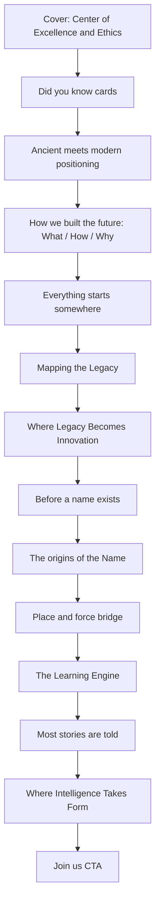

# Hephaestus International Website Plan

**Deliverable:** After you approve this plan, the first implementation step is to save this document as `[HEPHAESTUS_WEBSITE_PLAN.md](HEPHAESTUS_WEBSITE_PLAN.md)` in the project root, then begin coding.

**Repository state:** `[hephaestus-international](D:\Code Work\hephaestus-international)` contains `[AI Design and Coding Guide.md](AI Design and Coding Guide.md)`, `[Hephaestus International. Version 3.pdf](Hephaestus International. Version 3.pdf)`, and the **approved logo** (see Brand identity below). No Next.js app exists yet. Stack matches your requirements: scaffold **Next.js (App Router) + TypeScript + Tailwind** on Vercel.

### Brand identity (approved logo)

**Source file (user-provided):** [`assets/FloLabs_logo_Hephaestus.png`](assets/c__Users_cg980_AppData_Roaming_Cursor_User_workspaceStorage_empty-window_images_FloLabs_logo_Hephaestus-9d81512d-6fe1-4b64-8108-3e5b19a9b118.png)

**Mark description:** Minimal geometric hand icon: four vertical pill-shaped bars (varying heights) banded by a horizontal negative-space groove, plus a fifth shorter bar angled ~45° as a thumb. Flat design, no gradients or outlines.

**Colors:**
- **Logo fill:** vibrant corporate blue (existing vector uses `#1269C7`; PNG reads close to `#1D70C1`). Use **`#1269C7`** as `--color-brand-primary` unless stakeholder specifies otherwise.
- **Reference PNG background:** solid black (for dark-mode previews only; not a site-wide background requirement).

**Implementation (per guide):**
- Ship as **`public/logo.svg`** (preferred): recreate geometry from the approved mark using `fill="currentColor"` so the header/favicon stay legible in light and dark themes.
- Optional archive copy: `public/images/logo-reference.png` from the user file for design QA only.
- **`BrandLogo` component:** `next/image` or inline SVG in `SiteHeader` and footer; link to `/`; accessible `alt="Hephaestus International"`.
- **Favicon / app icon:** generated from `logo.svg` via Next.js metadata `icons`.
- **Do not** stretch, recolor to off-brand hues, or add glow/neon effects to the mark.

**Your choices:** Hybrid navigation (story homepage + existing utility routes). v1 includes the **Did you know** interactive cards using approved facts from slide 2 (excluding internal design-team notes).

---

## 1. Website goal

Build a professional, responsive marketing site for **Hephaestus International** that:

- Tells the approved Version 3 story in order, as a scroll experience (not a slide deck).
- Preserves presentation wording exactly via a centralized content module.
- Meets `[AI Design and Coding Guide.md](AI Design and Coding Guide.md)`: 12-column grid, light/dark mode, SEO metadata, accessibility, no em-dashes, correct nomenclature (Hephaestus, FloBrain, CAIPO, etc.).
- Preserves live URL paths where possible to avoid broken links and bookmarks.
- Deploys to Vercel.

---

## 2. Storytelling structure (presentation order)




---

## 3. Slide-to-section mapping


| PDF slide | Public section ID | Homepage section                 | Notes                                                                                                             |
| --------- | ----------------- | -------------------------------- | ----------------------------------------------------------------------------------------------------------------- |
| 1         | `hero`            | Hero                             | Tagline + "Be at the Center of the Future."                                                                       |
| 2         | `didYouKnow`      | Did you know (interactive cards) | **Exclude** "Note: For the design team" and wireframe instructions. **Include** facts + final card CTA text only. |
| 3         | `positioning`     | Brand positioning                | Four-line value prop block                                                                                        |
| 4         | `pillars`         | How we built the future          | Three columns: What / How / Why                                                                                   |
| 5         | `roots`           | Transition                       | Short four-line bridge                                                                                            |
| 6         | `mappingLegacy`   | Mapping the Legacy               | Title-only slide: visual/typography section; no extra copy invented                                               |
| 7         | `lemnos`          | Where Legacy Becomes Innovation  | Lemnos narrative                                                                                                  |
| 8         | `nameBridge`      | Transition                       | Three-line bridge                                                                                                 |
| 9         | `nameOrigins`     | The origins of the Name          | Name story                                                                                                        |
| 10        | `engineBridge`    | Transition                       | Three-line bridge                                                                                                 |
| 11        | `learningEngine`  | The Learning Engine              | Alexandria / Hypatia narrative                                                                                    |
| 12        | `formBridge`      | Transition                       | Two-line bridge                                                                                                   |
| 13        | `ecosystem`       | Where Intelligence Takes Form    | FloBrain, CAIPO, RoboShows blocks                                                                                 |
| 14        | `closingCta`      | Closing CTA                      | Questions + "Join us." + repeat tagline                                                                           |


---

## 4. Current website audit ([hephaestus.international](https://hephaestus.international/))


| Route                         | Status  | Current role                                                         |
| ----------------------------- | ------- | -------------------------------------------------------------------- |
| `/`                           | 200     | Marketing homepage: recruitment, verticals, generic AI/robotics copy |
| `/about`                      | 200     | EMP program, mission/objectives, team placeholder                    |
| `/projects`                   | 200     | Project grid (empty state) + accelerator CTA                         |
| `/internships`                | 200     | Internship positions                                                 |
| `/blogs`                      | 200     | Blog listing                                                         |
| `/contact`                    | 200     | Form + `info@hephaestus.international` + LinkedIn                    |
| `/login`                      | 200     | Account hub ("Centralize your whole journey...")                     |
| `/privacy`                    | **404** | Linked in footer but missing                                         |
| `/robots.txt`, `/sitemap.xml` | **404** | Not configured                                                       |


**Tech signals:** Next.js (`/_next/static/...`). Title/meta use **Hephaestus Labs Institute of Experiential Learning Center of Excellence** and generic SEO descriptions.

**Nav (live):** Blogs, About us, Projects, Internships, Log in. Contact exists but is not in primary nav.

**Footer project links:** CAIPO, Moodchanger.ai, Moodchanger for Pets, Flo Travel, Hephaestus Labs Institute, Flo Studios.

**Homepage themes (live, not in PDF):** "Our Verticals", "Long Live Learning", "Get Recruited Today", R&D incubator copy, benefits section.

---

## 5. What to keep from the current website

- **Routes:** `/`, `/about`, `/projects`, `/internships`, `/blogs`, `/contact`, `/login` (add/fix `/privacy`).
- **Contact details:** `info@hephaestus.international`, LinkedIn label "Hephaestus Labs Institute on LinkedIn" (confirm exact URL during implementation).
- **Footer project links** as external references until presentation-approved replacements exist.
- **Functional pages:** internships listing, login entry point, contact form behavior (wire to existing backend/API if discovered during scaffold; otherwise form UI + mailto fallback flagged as TODO).
- **Brand logo:** user-approved Hephaestus hand mark (see Brand identity). Implement as `public/logo.svg` with `currentColor`; sibling-repo SVG (`FloLabs_logo Hephaestus.svg`) is a geometry reference only if needed during SVG authoring.
- **SEO baseline:** keep recognizable paths; update titles/descriptions to presentation-led copy after approval of conflicts below.

---

## 6. What to replace from the current website

- **Homepage narrative:** replace generic recruitment/verticals copy with Version 3 story sections (table above).
- **Primary branding on marketing pages:** shift from "Hephaestus Labs Institute of Experiential Learning Center of Excellence" to **Hephaestus International** + **Center of Excellence and Ethics** per slide 1 (pending conflict approval).
- **Homepage H1/meta description:** replace "Innovation in AI & Robotics" boilerplate with approved presentation lines.
- **About page body:** replace EMP/mission blocks unless team approves merging into a secondary "Programs" area.
- **Projects page empty state:** replace with ecosystem section content (FloBrain, CAIPO, RoboShows) plus optional links to footer projects.
- **Broken `/privacy`:** implement page with legal copy (source TODO).

---

## 7. Page structure (hybrid)


| Page                            | Purpose                                                                                                                                               |
| ------------------------------- | ----------------------------------------------------------------------------------------------------------------------------------------------------- |
| `[/](.)`                        | Full presentation story (sections 1-14) + global header/footer                                                                                        |
| `[/about](./about)`             | Short anchor to story + only content explicitly approved for About (initially minimal or "learn more" links to homepage sections until copy approved) |
| `[/projects](./projects)`       | Ecosystem pillars from slide 13 + external project links from live footer                                                                             |
| `[/internships](./internships)` | Preserve internships UX; CTA language aligned to slide 14 where it does not conflict with live HR copy                                                |
| `[/blogs](./blogs)`             | Preserve route; placeholder or existing feed integration                                                                                              |
| `[/contact](./contact)`         | Preserve form + contact channels from live site                                                                                                       |
| `[/login](./login)`             | Preserve route; do not rewrite auth flows                                                                                                             |
| `[/privacy](./privacy)`         | New working page (fix 404)                                                                                                                            |


**Redirects:** none required if paths unchanged. If branding URLs change, add redirects only after explicit approval.

---

## 8. Homepage sections (implementation order)

1. `SiteHeader` (logo, nav, theme toggle, mobile menu)
2. `HeroSection` (slide 1)
3. `DidYouKnowSection` (slide 2 facts as cards/cassettes + final "Ready to hear the story? Our Story?" card scrolling to `#positioning`)
4. `PositioningSection` (slide 3)
5. `PillarsSection` (slide 4, 3-column grid)
6. `RootsTransition` (slide 5)
7. `MappingLegacySection` (slide 6, visual-forward)
8. `LemnosSection` (slide 7)
9. `NameBridgeTransition` (slide 8)
10. `NameOriginsSection` (slide 9)
11. `EngineBridgeTransition` (slide 10)
12. `LearningEngineSection` (slide 11)
13. `FormBridgeTransition` (slide 12)
14. `EcosystemSection` (slide 13: FloBrain, CAIPO, RoboShows)
15. `ClosingCtaSection` (slide 14)
16. `SiteFooter` (footer links, social, project links)

---

## 9. Components needed

**Layout:** `SiteHeader`, `SiteFooter`, `ThemeProvider`, `Container` (max-width + 12-col grid), `Section` (consistent vertical padding)

**Story sections:** one component per section ID above (thin wrappers reading from content file)

**UI primitives (guide-aligned):** `Button`, `Card`, `Icon` wrapper, `PillarCard`, `DidYouKnowCard`, `EcosystemCard`, `TransitionBlock`, `CtaBand`

**Brand:** `BrandLogo` (SVG/`currentColor`, links home)

**Utilities:** `ThemeToggle`, `MobileNav`, `SkipToContent`

**SEO:** `buildMetadata()` using content-driven title/description + `public/og-image.png`

**Content:** `[content/site-content.ts](content/site-content.ts)` (single source of truth; typed keys per section)

---

## 10. Visual direction (from presentation + guide)

- **Tone:** clean, professional, craft/forge metaphor without neon gradients or generic AI glow.
- **Layout:** strict 12-column grid; centered max-width container at 1440px+.
- **Typography:** clear hierarchy (hero, section titles, body, labels); `text-wrap: balance` on headings; no orphan words.
- **Color:** neutral backgrounds with **brand primary blue `#1269C7`** (from approved logo) for links, focus rings, and key accents; optional secondary neutral/warm tone for forge/legacy sections only if it does not compete with the mark. Full light/dark tokens.
- **Logo in UI:** header uses the blue mark via `currentColor` or explicit `text-brand-primary`; ensure contrast on both light (white/near-white header) and dark (near-black header) surfaces.
- **Slide 6:** treat as editorial/visual interlude ("Mapping the Legacy"), not a text wall.
- **Slide 2 cards:** horizontal scroll or stacked cassettes on mobile; keyboard-accessible focus states.
- **Imagery:** Lemnos/forge/learning metaphors; placeholders marked TODO until final assets supplied.

---

## 11. Image and asset requirements


| Asset                      | Path                  | Source                                   |
| -------------------------- | --------------------- | ---------------------------------------- |
| Logo (SVG, theme-aware)    | `public/logo.svg`     | **Approved:** user-provided hand mark; author SVG with `currentColor` (geometry reference: FloLabs Hephaestus SVG or trace from PNG in `assets/`) |
| Logo reference (optional)  | `assets/` or `public/images/logo-reference.png` | User PNG preserved for QA |
| OG image (16:9)            | `public/og-image.png` | **TODO:** brand-approved marketing image (may include logo + tagline on neutral background) |
| Favicon                    | from `logo.svg`       | per guide                                |
| Lemnos / legacy visuals    | `public/images/...`   | **TODO:** photography or illustrations   |
| Mapping the Legacy graphic | optional              | **TODO:** design team asset              |
| Hypatia reference          | link in content       | **TODO:** URL from slide 11 note         |
| Project icons/links        | footer                | reuse live external URLs where valid     |


---

## 12. SEO and redirect considerations

- **Default metadata (post-approval):** title from slide 1; description 1-2 sentences from slide 1-3 (exact copy, no em-dashes).
- **Open Graph / Twitter:** `og-image.png`, `logo.svg`, per guide section 11.
- **Per-route metadata:** inherit brand suffix consistently (decide: "Hephaestus International" vs live long name after conflict resolution).
- **Add** `app/sitemap.ts` and `app/robots.ts` (currently missing on live).
- **Structured data:** optional `Organization` schema after legal name approval.
- **Redirects:** none in v1 unless renamed routes approved.

---

## 13. Content TODOs

Copy must be transcribed from PDF into `content/site-content.ts` **verbatim** (fix only encoding artifacts with explicit TODO flags):

1. **Hypatia link:** slide 11 `(Insert the link*)` needs URL from stakeholder.
2. **Pandora's Box line:** slide 2 shows `8Pandora9s Box9` in PDF extraction: confirm intended punctuation (`Pandora's Box`).
3. **Grammar in slide 7:** `"For us, is the place"` confirm whether a word is missing (`For us, it is...`).
4. **Slide 11 typo:** `"But with very system"` likely `"every system"`: confirm before publish.
5. **Slide 2 trailing `=`** on Lemnos date line: confirm if stray character.
6. **Ellipsis vs dash:** presentation uses `…`; guide forbids em-dashes (`—`). Preserve ellipsis as in approved PDF text.
7. **Privacy policy body:** not in PDF; legal review required.
8. **LinkedIn URL:** extract from live site or stakeholder.
9. **Social "FOLLOW US" targets:** live HTML did not expose URLs in fetch; confirm Instagram/X/etc.
10. **About / Internships / Blogs / Login** page copy: keep live functional text until replaced copy is approved.
11. **og-image.png:** design deliverable.
12. **Contact form endpoint:** confirm if live site posts to an API.

---

## 14. Acceptance criteria

- `HEPHAESTUS_WEBSITE_PLAN.md` committed at repo root (post-approval step 1).
- All presentation public copy lives in `content/site-content.ts` with zero unauthorized rewrites.
- Homepage implements slides 1, 2 (facts only), 3-14 in order.
- Hybrid routes exist and render without 404 for listed paths; `/privacy` works.
- 12-column responsive layout verified at 320, 768, 1024, 1440px per QA checklist in guide.
- Light/dark mode: readable text, visible borders, no flash on load.
- `public/logo.svg` + `public/og-image.png` referenced in metadata.
- No em-dashes in UI/copy.
- Nomenclature: Hephaestus, FloBrain, CAIPO spelled per guide.
- Conflict list reviewed with stakeholder sign-off before replacing live homepage/meta branding.

---

## 15. Conflict list (presentation vs live site)


| Topic             | Presentation (source of truth)                 | Live site                                                               | Resolution needed                                      |
| ----------------- | ---------------------------------------------- | ----------------------------------------------------------------------- | ------------------------------------------------------ |
| Organization name | Hephaestus International                       | Hephaestus Labs Institute of Experiential Learning Center of Excellence | **Approve** customer-facing name for H1, title, footer |
| Tagline           | Center of Excellence and Ethics                | Generic AI & robotics innovation                                        | **Approve** SEO title/description                      |
| Homepage story    | 14-slide narrative                             | Recruitment, verticals, benefits                                        | **Replace** homepage with presentation (approved)      |
| Ecosystem focus   | FloBrain, CAIPO, RoboShows                     | CAIPO, Moodchanger, Flo Travel, Flo Studios, etc.                       | **Approve** projects page: pillars vs footer link list |
| About content     | Not in PDF                                     | EMP program + mission/objectives                                        | **Approve** keep, relocate, or strip About page        |
| CTA phrasing      | "Join us." / "Be at the Center of the Future." | "Get Recruited Today"                                                   | **Approve** CTA on internships/home                    |
| Contact branding  | Hephaestus International (contact title)       | Mixed naming                                                            | Align footer/header with approved name                 |
| Privacy           | N/A                                            | Footer link 404                                                         | Implement with legal copy (not in PDF)                 |
| Login copy        | N/A                                            | Journey hub copy                                                        | Keep functional page unchanged in v1 unless approved   |


---

## Technical implementation outline (post-approval)

```text
hephaestus-international/
  app/
    layout.tsx          # fonts, ThemeProvider, metadata defaults
    page.tsx            # homepage sections
    about/page.tsx
    projects/page.tsx
    internships/page.tsx
    blogs/page.tsx
    contact/page.tsx
    login/page.tsx
    privacy/page.tsx
    sitemap.ts
    robots.ts
  components/
    layout/ ...
    sections/ ...
    ui/ ...
  content/
    site-content.ts     # ALL approved copy
  assets/
    FloLabs_logo_Hephaestus.png   # approved reference (user-provided)
  public/
    logo.svg                      # theme-aware SVG from approved mark
    og-image.png                  # TODO asset
  tailwind.config.ts              # --color-brand-primary: #1269C7
```

**Dependencies (minimal):** `next`, `react`, `react-dom`, `typescript`, `tailwindcss`, `next-themes` (or CSS-only theme if preferred to avoid deps). No CMS in v1.

**Reference only:** `[FloLabs International/lib/site-data.ts](D:\Code Work\FloLabs International\lib\site-data.ts)` for short Hephaestus blurb and logo path, not as copy source.

---

## Summary for approval (your requested recap)

1. **Structure:** Story homepage + `/about`, `/projects`, `/internships`, `/blogs`, `/contact`, `/login`, `/privacy`.
2. **Story flow:** Cover → Did you know → positioning → pillars → legacy/Lemnos → name origins → learning engine → ecosystem → join CTA.
3. **Design:** Professional, grid-based, light/dark, forge/legacy visual language, no over-designed AI tropes.
4. **Components:** ~15 section components + header/footer/theme/grid primitives + content-driven cards.
5. **TODOs:** Hypatia link, PDF typos/encoding, privacy legal text, og-image, social URLs, form backend, About/internships copy alignment.
6. **Conflicts:** Naming, homepage narrative, project emphasis, About page, CTA wording, privacy 404 (see section 15).

**Next step after you approve:** Write `HEPHAESTUS_WEBSITE_PLAN.md`, then scaffold Next.js and implement v1.